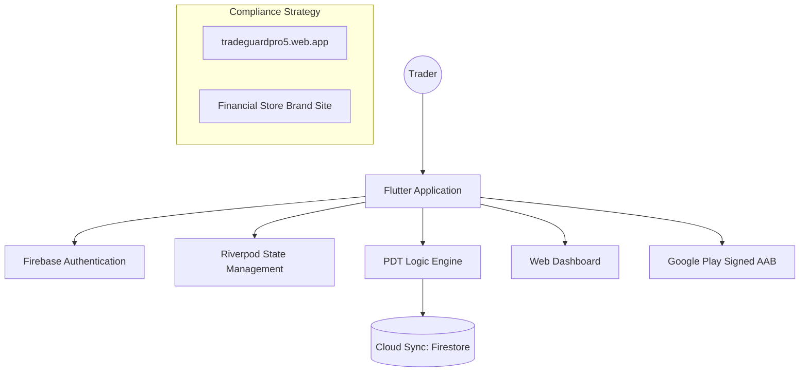

# 🛡️ TradeGuard: Comprehensive Project Walkthrough

TradeGuard is a premium, USA-standard trading utility designed to protect retail traders from **Pattern Day Trader (PDT)** violations. It combines precise financial logic with cloud-native synchronization to provide a foolproof "safety net" for active traders.

---

## 🧭 Project Mission & Problem Solved

### The Problem: The PDT Rule
The SEC's Pattern Day Trader rule restricts traders with less than $25,000 in their accounts to only **3 day-trades in a rolling 5-business-day period**. Accidental violations lead to a **90-day account freeze**, which can be devastating for a trader.

### The Solution: TradeGuard
TradeGuard serves as an external "Counter and Kill-Switch." 
- It tracks every trade in real-time.
- It calculates exactly when "strikes" (day-trades) expire based on US Market holidays and T+1 settlement.
- It enforces a visual and functional "lockdown" when the limit is reached.

---

## 🏗️ Technical Architecture

TradeGuard is built as a multi-platform ecosystem (iOS, Android, Web, Brand Site) powered by a central Firebase backbone.

---

## 🏦 Product Ecosystem: The Dual-Site Strategy

To resolve "phishing" flags and ensure absolute compliance with Google and Firebase reviewer policies, the project is split into two distinct entities:

1.  **TradeGuard Pro (The App)**: 
    - **URL**: `tradeguardpro5.web.app`
    - **Purpose**: The actual tool where users log in, add trades, and sync data. 
    - **Focus**: Functionality, privacy, and security.

2.  **Financial Store (The Brand Site)**:
    - **URL**: Linked to the verified brand domain.
    - **Directory**: [brand_website/](file:///e:/USA/TradeGaurd/brand_website/)
    - **Purpose**: A "Safe Surface" landing page used for brand verification. It contains legal links, pricing, and refund policies in a professional format to establish trust with reviewers.

---

## ⚙️ Core Logic (The "PDT Engine")

The heart of the application lies in [main.dart](file:///e:/USA/TradeGaurd/lib/main.dart).

### 1. Market Awareness
The app contains a hardcoded list of **US Stock Market Holidays (2026)** to ensure calculations are accurate to the business day, not just the calendar day.
- **T+1 Settlement**: Logic that precisely timestamps when funds and strikes "clear" the ledger.
- **Rolling Winow**: Calculations that determine "Trading Sessions Left" rather than simple hours.

### 2. Pro Feature: Cloud Sync
- **Non-Pro**: Data is stored locally via `SharedPreferences`.
- **Pro**: Real-time bidirectional sync with Firestore. If a user switches devices, their trades and account lockdowns follow them instantly.

---

## 🔑 Key Technical Assets & Credentials

### 1. Firebase Project Details
- **Project ID**: `tradeguardpro5`
- **Location**: `us-central`
- **Configuration**: Found in [firebase_options.dart](file:///e:/USA/TradeGaurd/lib/firebase_options.dart).

### 2. Authentication (Google Sign-In)
- **Web Client ID**: `118109513018-7ivqfotsk4umcmggvnnfli2blvj8f5r8.apps.googleusercontent.com`
- **Note**: This is critical for cross-platform login and Cloud Sync.

### 3. Application Versioning
- **Package Name**: `com.tradeguard`
- **Current Version**: `1.0.0+1`

### 4. Production Signing (Play Store)
- **Keystore**: `upload-keystore.jks` (located in `android/app/`)
- **Alias**: `upload`
- **Password**: `TradeGuard@2026`

---

## 🛠️ User Flow walkthrough

1.  **Entry**: User opens the app; `SplashScreen` displays the premium TradeGuard branding.
2.  **Auth**: User logs in with Google. 
    - If **Pro**: App streams their status from Firestore and restores all accounts.
    - If **Basic**: App uses local storage and restricts backup features.
3.  **Dashboard**: A high-tech "monospaced" interface showing:
    - **Strikes Available**: (0 to 3).
    - **Oldest Expiry**: Real-time countdown to their next available trade.
    - **Lockdown Status**: Warning if proximity to PDT violation is high.
4.  **Transaction**: User adds a ticker (e.g., AAPL). The app immediately calculates the 5-day trading window and settlement.
5.  **Exhaustion**: On the 4th trade attempt, the app triggers a `LockdownMode`, preventing further additions to protect the user's brokerage account.

---

## 📜 Legal & Compliance Foundation

The project includes four critical legal documents required for Play Store and Google Authentication verification:
- **Terms of Service**: Detailed user obligations.
- **Privacy Policy**: Explaining Google Login and Data usage.
- **Refund Policy**: For Pro subscriptions.
- **Pricing**: Transparent tiering.

These are accessible via [legal_screens.dart](file:///e:/USA/TradeGaurd/lib/legal_screens.dart) and hosted on both the app and brand site.

---

> [!TIP]
> **Maintenance Recommendation**: When adding new features, always ensure the `usHolidays` list in `main.dart` is updated for the following year to maintain calculation accuracy.
